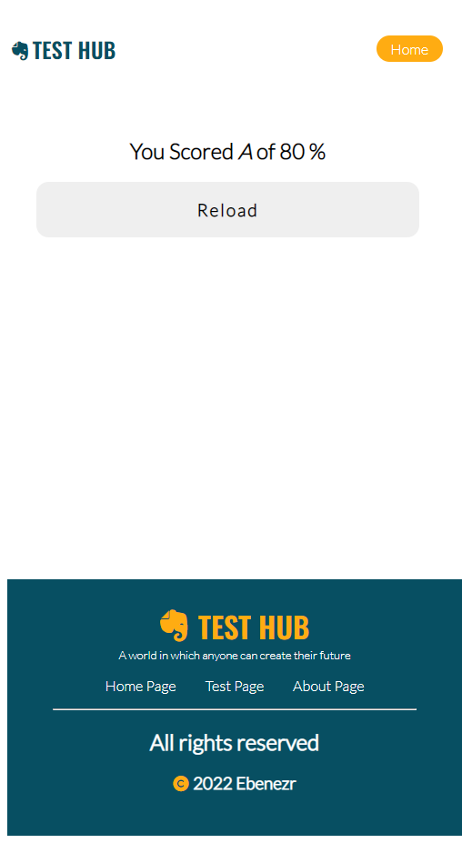

# Test Hub 

Test Hub is web application that enables students to take multiple answered questions then mark and present the score to the students.The test is timed and will end either when time is over or the student submits before time. The project uses Javascript for the logic, HTML for page structure and Vanilla css for site styling.
***
## Author 

**Bukosia Ebenezar**
***

## Screenshots

### landing page
#### Mobile

#### Desktop

***
### test page
#### Mobile

#### Desktop

***
### results page
#### Mobile

#### Desktop

***
## Figma Designs
- landing page
  https://www.figma.com/file/bLyP3eHm0qrAxW8Rs3hzBg/landingpagePC?node-id=2%3A2
- test page
  https://www.figma.com/file/q7fcFtHIOATLWMITqM46n7/testpagePC?node-id=0%3A1  

---
## Table of content
- [Technologies](#description)
- [Description](#description)
- [Features](#features)
- [Setup-process](#setup_process)
- [Project-usage](#project-usage)
- [Copyright](#copyright)
- [Licence](#licence)
  
---
## Technologies

languages used are: 
- HTML :HTML5 -which is used to create the structure of thr page
- CSS :CSS4 -used to style the page
- JavaScript -used to code app logic

---
### Features
As a user you ase able to:
  1 navigate through the site
  2 user can take a test
  3 app will mark and grade the students
  4 the app will time the student 
  5 the app will display students results after submission or when time is over

---
### description
I used java script to create a dynamic site and also to create some complex function such as timing and marking and grading of the test.
I used html in creating the page structure and css in styling the document.
I also used an external css to enable me to use fa icons
css link https://cdnjs.cloudflare.com/ajax/libs/font-awesome/4.7.0/css/font-awesome.min.css

--- 
### challenges 
The major challenge I faces was implementing timer per question function. 

---
## How to set up and run the project

#### method one
clone the repo using the command
- $git clone https://github.com/Ebenezr/Test-hub.git
change directory using command
- $cd landing-page

---
#### live link
   \- click the following link to view the application https://ebenezr.github.io/Test-hub/

***
## How to use the project

The project root folder contains two files, main **index.html** and **README.md** file and one folder assets folder. the assets folder within it are four folders **css** which contains css files and **images** folder which contains images *js* which contains JavaScript files and pages folder containing secondary pages used in the project.

***
## Copyright
 Copyright(c)[2022][Bukosia Ebenezar]

***
## Licence

MIT License

***